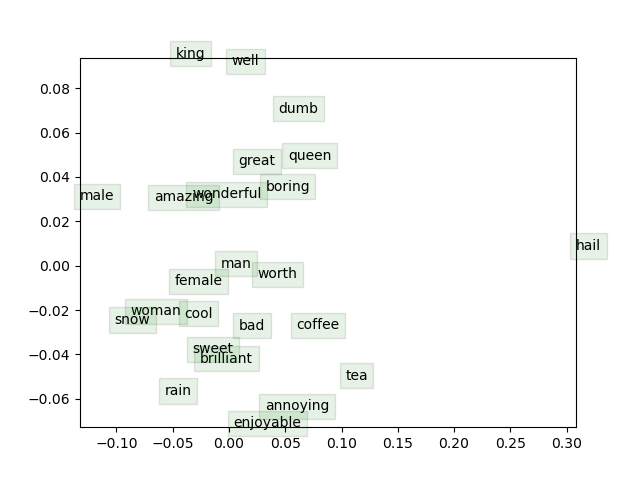

# CS224N-Assignments
The assignments of Stanford CS224N: NLP with Deep Learning | Winter 2019

### Result of each assignment:

- Assignment2: word2vec

    

    
    

- Assignment3: Dependency Parsing
    - The code is modified to support training on **CUDA**, about **30x** faster!
    - Result:
        - Average Train Loss: $0.018$
        - best dev UAS: $88.32\%$​
        - test UAS: $89.06\%$
